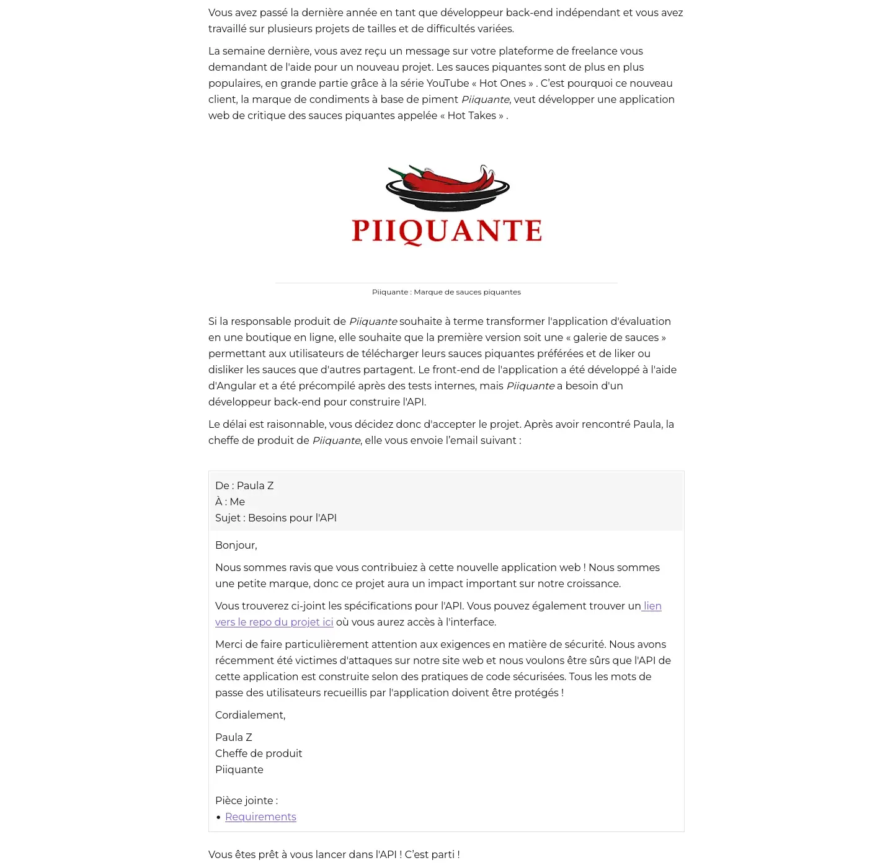

# Piiquante

Développer le back-end du site Piiquante avec node-js et express, ainsi que de mongo-db pour la base de données.

## instructions

Spécifications fonctionnelles : [Link](https://github.com/julabina/P6_OC_Piiquante/blob/master/readme_assets/Requirements_DW_P6.pdf)